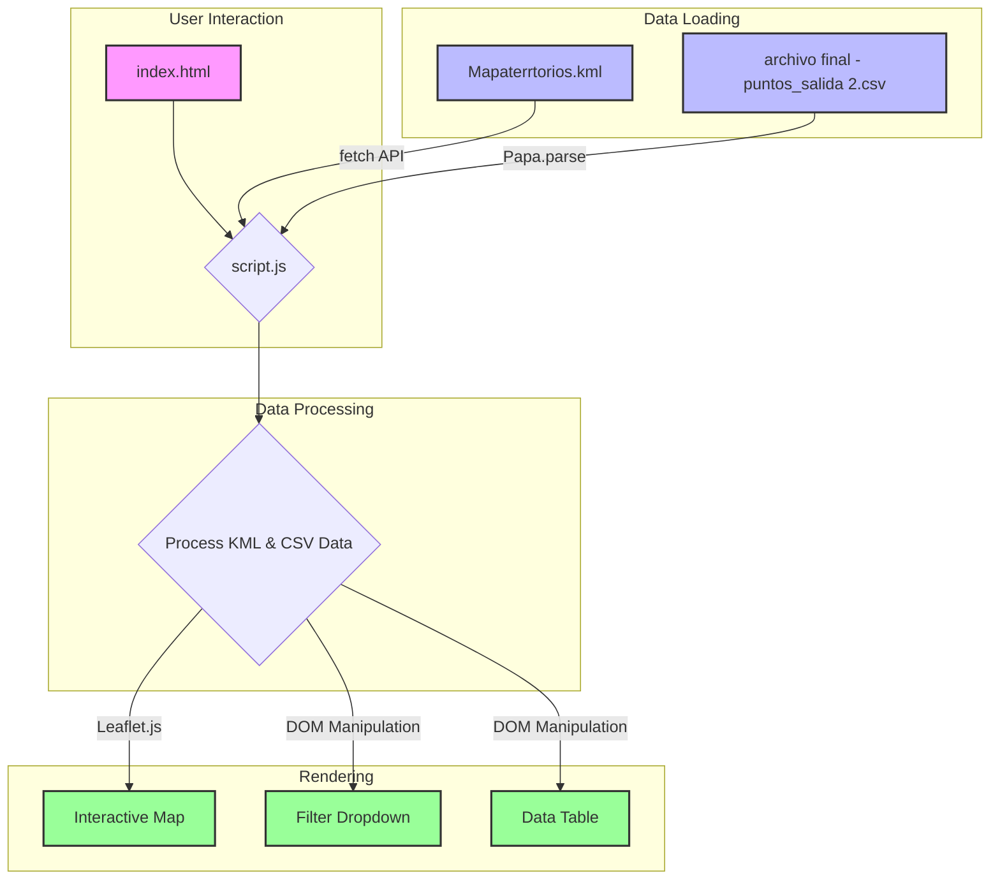
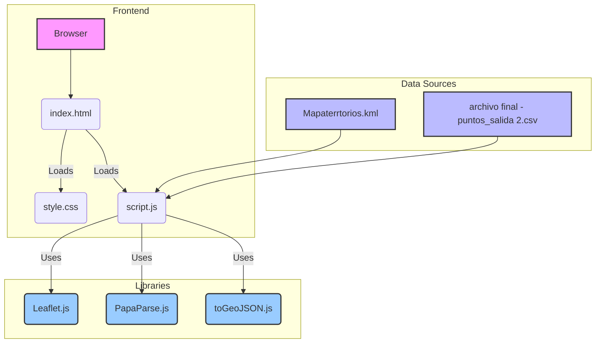

# Interactive Territory and Point Map Viewer

This is a web-based mapping application designed to visualize geographical data from multiple sources. It renders polygon-based territories from a KML file and overlays numbered point-of-interest markers from a CSV file.

## Key Features
*   **Interactive Map:** Built with Leaflet.js, displaying KML territories and custom-styled CSV data points.
*   **Custom Markers:** Point markers are dynamically generated with a custom "map pin" style, displaying a unique number from the dataset directly on the icon.
*   **Territory Filtering:** A dropdown menu allows users to filter the displayed points based on the KML territory they belong to.
*   **Data Table:** A responsive and interactive table displays the details of the points currently visible on the map.
*   **Map-Table Interaction:** Clicking a marker on the map highlights and scrolls to the corresponding row in the data table for easy reference.

***

# Visor de Mapa Interactivo de Territorios y Puntos

Esta es una aplicación de mapeo web diseñada para visualizar datos geográficos de múltiples fuentes. Renderiza territorios poligonales desde un archivo KML y superpone marcadores de puntos de interés numerados desde un archivo CSV.

## Características Principales
*   **Mapa Interactivo:** Construido con Leaflet.js, muestra territorios KML y puntos de datos CSV con un estilo personalizado.
*   **Marcadores Personalizados:** Los marcadores de los puntos se generan dinámicamente con un estilo de "pin de mapa", mostrando un número único del set de datos directamente en el ícono.
*   **Filtro por Territorio:** Un menú desplegable permite a los usuarios filtrar los puntos mostrados en el mapa según el territorio KML al que pertenecen.
*   **Tabla de Datos:** Una tabla interactiva y responsiva muestra los detalles de los puntos actualmente visibles en el mapa.
*   **Interacción Mapa-Tabla:** Al hacer clic en un marcador en el mapa, se resalta y se desplaza a la fila correspondiente en la tabla de datos para una fácil referencia.

***

# Technical Diagrams

## Data Flow

## Component Architecture

